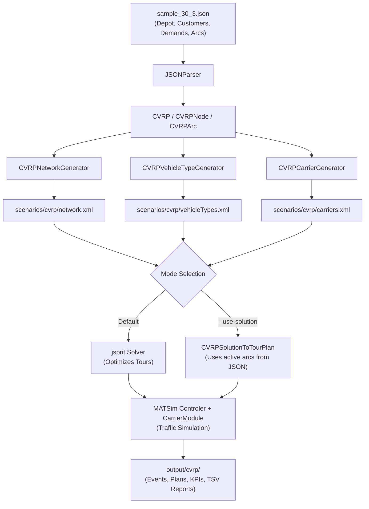

# MATSim for CVRP (Capacitated Vehicle Routing Problem)

This project integrates **CVRP instances** into the agent-based transport simulation **MATSim** using the **Freight Extension** (`matsim-contrib-freight`) and the integrated VRP solver **jsprit**.

It allows automatically reading CVRP problem instances and solutions in JSON format (`original-input-data/cvrp-instances`), converting them into complete MATSim scenarios (`scenarios/cvrp`), and running microscopic simulations of freight movements on the road network.

---

## Table of Contents
- [Overview & Workflow](#overview--workflow)
- [Project Structure](#project-structure)
- [Prerequisites](#prerequisites)
- [Running the Freight Simulation](#running-the-freight-simulation)
  - [Mode 1: Solve VRP with jsprit & Simulate (Default)](#mode-1-solve-vrp-with-jsprit--simulate-default)
  - [Mode 2: Simulate Pre-computed Solution from JSON](#mode-2-simulate-pre-computed-solution-from-json)
- [Outputs and Analysis](#outputs-and-analysis)
- [Development in the IDE](#development-in-the-ide)
- [License](#license)

---

## Overview & Workflow

The toolchain follows this workflow:



1. **Parser**: Reads nodes (depot + customers with demands), arcs with costs, and vehicle capacities from a CVRP JSON file (e.g. `original-input-data/cvrp-instances/sample_30_3.json`).
2. **Network Generator**: Converts coordinates into MATSim nodes and links with euclidean distances, creating auxiliary service links for loading and unloading operations.
3. **Vehicle Type & Carrier**: Defines truck vehicle types with capacity constraints and carriers with services (customer orders at their delivery locations).
4. **Tour Planning & Simulation**:
   - Either jsprit solves the Vehicle Routing Problem autonomously,
   - or a pre-computed solution (`solution`) present in the JSON is reconstructed as a tour plan.
5. **Mobsim**: MATSim simulates the trucks on the road network, modeling travel times, waiting times, and unloading activities.

---

## Project Structure

```
src/main/java/org/matsim/project/
├── businessModels/             # CVRP data models
│   ├── CVRP.java               # Overall instance (nodes, arcs, capacity, fleet size)
│   ├── CVRPNode.java           # Node (ID, coordinates x/y, demand)
│   └── CVRPArc.java            # Arcs (source, destination, cost, active in solution)
├── parser/
│   └── JSONParser.java         # Parser for CVRP JSON files
├── converter/                  # MATSim converters
│   ├── CVRPNetworkGenerator.java     # Generates MATSim network.xml + service links
│   ├── CVRPVehicleTypeGenerator.java # Generates vehicleTypes.xml with capacities & costs
│   ├── CVRPCarrierGenerator.java     # Generates carriers.xml with services & fleet
│   └── CVRPSolutionToTourPlan.java   # Converts JSON solution vectors into tour plans
├── RunCVRPFreightSimulation.java     # Main class & entry point for the simulation
├── MatsimModelImplementation.java    # MATSimApplication baseline example
└── RunMatsimModelImplementation.java # Runner for the MATSimApplication scenario

original-input-data/cvrp-instances/
└── sample_30_3.json            # Sample CVRP instance (30 customers, 1 depot)

scenarios/cvrp/
├── config.xml                  # MATSim configuration file for freight
├── network.xml                 # Generated road network
├── vehicleTypes.xml            # Generated vehicle types
├── carriers.xml                # Generated freight carriers & services
└── planned_carriers.xml        # Tour plans computed by jsprit
```

---

## Prerequisites

- **Java JDK 25** (or a configured SDK in IntelliJ / Eclipse)
- **Maven** (or the included Maven Wrapper `./mvnw`)

---

## Running the Freight Simulation

Compile the project before running:

```bash
mvn compile
```

Two simulation modes are available:

### Mode 1: Solve VRP with jsprit & Simulate (Default)

In this mode, only customer orders (services) and fleet capacities are loaded from the JSON. The integrated **jsprit** algorithm solves the routing problem and optimizes vehicle tours. Afterward, MATSim simulates their execution on the road network:

```bash
mvn exec:java -Dexec.mainClass="org.matsim.project.RunCVRPFreightSimulation"
```

### Mode 2: Simulate Pre-computed Solution from JSON

In this mode, the reference solution stored in the JSON dataset (`"solution": [[source, dest, active], ...]`) is parsed, converted into complete MATSim tours, routed on the road network, and simulated:

```bash
mvn exec:java -Dexec.mainClass="org.matsim.project.RunCVRPFreightSimulation" -Dexec.args="--use-solution"
```

---

## Outputs and Analysis

All results are written to `./output/cvrp/` by default:

| Path / File | Description |
|---|---|
| `output_events.xml.zst` | Detailed chronological event history (departures, link entries/exits, arrivals, service starts/ends). |
| `output_carriers.xml.zst` | Complete executed tour plans for all carriers. |
| `output_network.xml.zst` | Simulated network in MATSim format. |
| `analysis/freight/Carriers_KPIs.tsv` | Key performance indicators (number of used vehicles, handled jobs, computation time). |
| `analysis/freight/Carriers_stats.tsv` | Carrier statistics (planned vs. handled demand, number of tours). |
| `analysis/freight/TimeDistance_perVehicle.tsv` | Detailed travel times, distances, and costs broken down per vehicle. |
| `analysis/freight/TimeDistance_perCarrier.tsv` | Total tour durations, travel times, distances, and costs per carrier. |
| `analysis/freight/Load_perVehicle.tsv` | Vehicle load profiles and maximum capacity utilization along each tour. |

---

## Development in the IDE

### IntelliJ IDEA
1. Go to `File -> Open` and select the project directory.
2. IntelliJ detects the project as a Maven project (if not: right-click `pom.xml` -> `Add as Maven Project`).
3. Under `Project Structure`, make sure the Project SDK is set to **Java 25**.
4. The class `RunCVRPFreightSimulation.java` can be launched directly with a right-click (`Run 'RunCVRPFreightSimulation.main()'`). To run the pre-computed solution, add `--use-solution` under *Program arguments* in the Run Configuration.

### Eclipse
1. Go to `File -> Import... -> Maven -> Existing Maven Projects`.
2. Select the project directory and finish the import.
3. Ensure the Java 25 Execution Environment is configured and active.

---

## License

- The **MATSim program code** is licensed under the [GNU General Public License v2](https://www.gnu.org/licenses/old-licenses/gpl-2.0.en.html).
- Input and output data files are licensed under the [Creative Commons Attribution 4.0 International License (CC BY 4.0)](http://creativecommons.org/licenses/by/4.0/).
