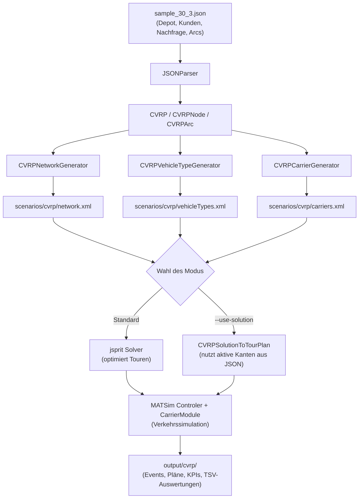

# MATSim for CVRP (Capacitated Vehicle Routing Problem)

Dieses Projekt integriert **CVRP-Instanzen** in die agentenbasierte Verkehrssimulation **MATSim** unter Verwendung der **Freight-Extension** (`matsim-contrib-freight`) und des integrierten VRP-Solvers **jsprit**.

Es ermöglicht das automatische Einlesen von CVRP-Probleminstanzen und -Lösungen im JSON-Format (`/original-input-data/cvrp-instances`), die Konvertierung in vollständige MATSim-Szenarien (`scenarios/cvrp`) und die mikroskopische Simulation der Güterverkehrsbewegungen im Straßennetz.

---

## Inhaltsverzeichnis
- [Überblick & Funktionsweise](#überblick--funktionsweise)
- [Projektstruktur](#projektstruktur)
- [Voraussetzungen](#voraussetzungen)
- [Ausführung der Freight-Simulation](#ausführung-der-freight-simulation)
  - [Modus 1: VRP mit jsprit lösen & simulieren (Standard)](#modus-1-vrp-mit-jsprit-lösen--simulieren-standard)
  - [Modus 2: Vorgefertigte Lösung aus JSON simulieren](#modus-2-vorgefertigte-lösung-aus-json-simulieren)
- [Ausgaben und Analyse](#ausgaben-und-analyse)
- [Entwicklung in der IDE](#entwicklung-in-der-ide)
- [Lizenz](#lizenz)

---

## Überblick & Funktionsweise

Das Toolchain-Prinzip folgt dem Ablauf:



1. **Parser**: Liest Knoten (Depot + Kunden mit Nachfrage/Demand), Kanten mit Kosten sowie Fahrzeugkapazitäten aus einer CVRP-JSON-Datei (z. B. `original-input-data/cvrp-instances/sample_30_3.json`).
2. **Netzwerk-Generator**: Wandelt die Koordinaten in MATSim-Knoten und Kanten mit euklidischen Distanzen um und erzeugt Service-Links für Be- und Entladevorgänge.
3. **Fahrzeugtyp & Carrier**: Legt LKW-Fahrzeugtypen mit Kapazitätsgrenzen sowie Carrier mit Services (Kundenaufträge am Zielort) an.
4. **Tourenplanung & Simulation**: 
   - Entweder löst jsprit das Vehicle Routing Problem eigenständig,
   - oder eine in der JSON bereits vorhandene Lösung (`solution`) wird als Tourenplan rekonstruiert.
5. **Mobsim**: MATSim simuliert die LKWs auf dem Straßennetzwerk inklusive Fahrzeiten, Wartezeiten und Entladevorgängen.

---

## Projektstruktur

```
src/main/java/org/matsim/project/
├── businessModels/             # Datenmodelle für CVRP
│   ├── CVRP.java               # Gesamtinstanz (Knoten, Kanten, Kapazität, Flotte)
│   ├── CVRPNode.java           # Knoten (ID, Koordinaten x/y, Demand)
│   └── CVRPArc.java            # Kanten (Quelle, Ziel, Kosten, aktiv in Lösung)
├── parser/
│   └── JSONParser.java         # Parser für CVRP-JSON-Dateien
├── converter/                  # MATSim-Konverter
│   ├── CVRPNetworkGenerator.java     # Erzeugt MATSim network.xml + Service-Links
│   ├── CVRPVehicleTypeGenerator.java # Erzeugt vehicleTypes.xml mit Kapazitäten & Kosten
│   ├── CVRPCarrierGenerator.java     # Erzeugt carriers.xml mit Services & Flotte
│   └── CVRPSolutionToTourPlan.java   # Wandelt JSON-Lösungsvektoren in Tourpläne um
├── RunCVRPFreightSimulation.java     # Hauptklasse & Einstiegspunkt für die Simulation
├── MatsimModelImplementation.java    # MATSimApplication-Basisbeispiel
└── RunMatsimModelImplementation.java # Runner für das MATSimApplication-Szenario

original-input-data/cvrp-instances/
└── sample_30_3.json            # Beispiel-CVRP-Instanz (30 Kunden, 1 Depot)

scenarios/cvrp/
├── config.xml                  # MATSim-Konfigurationsdatei für Freight
├── network.xml                 # Generiertes Straßennetzwerk
├── vehicleTypes.xml            # Generierte Fahrzeugtypen
├── carriers.xml                # Generierte Frachtführer & Services
└── planned_carriers.xml        # Von jsprit berechnete Tourpläne
```

---

## Voraussetzungen

- **Java JDK 25** (oder passendes SDK in IntelliJ / Eclipse eingerichtet)
- **Maven** (oder der beiliegende Maven-Wrapper `./mvnw`)

---

## Ausführung der Freight-Simulation

Vor der ersten Ausführung das Projekt kompilieren:

```bash
mvn compile
```

Es stehen zwei Modi für die Simulation zur Verfügung:

### Modus 1: VRP mit jsprit lösen & simulieren (Standard)

In diesem Modus werden nur die Kundenaufträge (Services) und Flottenkapazitäten aus der JSON geladen. Der integrierte **jsprit**-Algorithmus optimiert die Touren selbstständig. Anschließend simuliert MATSim die Ausführung im Netzwerk.

```bash
mvn exec:java -Dexec.mainClass="org.matsim.project.RunCVRPFreightSimulation"
```

### Modus 2: Vorgefertigte Lösung aus JSON simulieren

In diesem Modus wird die im JSON-Datensatz hinterlegte Referenzlösung (`"solution": [[source, dest, active], ...]`) eingelesen, in vollständige MATSim-Touren umgewandelt und auf dem Straßennetz geroutet und simuliert:

```bash
mvn exec:java -Dexec.mainClass="org.matsim.project.RunCVRPFreightSimulation" -Dexec.args="--use-solution"
```

---

## Ausgaben und Analyse

Alle Ergebnisse werden standardmäßig in `./output/cvrp/` gespeichert:

| Pfad / Datei | Beschreibung |
|---|---|
| `output_events.xml.zst` | Detaillierte chronologische Event-Historie (Abfahrt, Linkwechsel, Ankunft, Service-Start/Ende). |
| `output_carriers.xml.zst` | Vollständige ausgeführte Tourenpläne aller Carrier. |
| `output_network.xml.zst` | Simuliertes Netzwerk im MATSim-Format. |
| `analysis/freight/Carriers_KPIs.tsv` | Wichtigste Kennzahlen (eingesetzte Fahrzeuge, Anzahl erledigter Jobs, Rechenzeit). |
| `analysis/freight/Carriers_stats.tsv` | Statistiken je Carrier (geplante vs. bediente Nachfrage, Anzahl Touren). |
| `analysis/freight/TimeDistance_perVehicle.tsv` | Detaillierte Fahrzeiten, Distanzen und Kosten aufgeschlüsselt je LKW. |
| `analysis/freight/TimeDistance_perCarrier.tsv` | Summe der Tourdauern, Fahrzeiten, Gesamtdistanzen und Kosten je Carrier. |
| `analysis/freight/Load_perVehicle.tsv` | Ladezustände und maximale Kapazitätsauslastung der LKWs entlang ihrer Tour. |

---

## Entwicklung in der IDE

### IntelliJ IDEA
1. `File -> Open` und das Projektverzeichnis auswählen.
2. IntelliJ erkennt das Projekt als Maven-Projekt (falls nicht: Rechtsklick auf `pom.xml` -> `Add as Maven Project`).
3. Unter `Project Structure` sicherstellen, dass das Project SDK auf **Java 25** eingestellt ist.
4. Die Klasse `RunCVRPFreightSimulation.java` kann direkt per Rechtsklick (`Run 'RunCVRPFreightSimulation.main()'`) gestartet werden. Für die vorgefertigte Lösung kann in der Run-Configuration unter *Program arguments* `--use-solution` eingetragen werden.

### Eclipse
1. `File -> Import... -> Maven -> Existing Maven Projects` wählen.
2. Projektordner auswählen und importieren.
3. Sicherstellen, dass das Java 25 Execution Environment aktiv ist.

---

## Lizenz

- Der **MATSim-Code** unterliegt der [GNU General Public License v2](https://www.gnu.org/licenses/old-licenses/gpl-2.0.en.html).
- Input- und Output-Dateien unterliegen der [Creative Commons Attribution 4.0 International License (CC BY 4.0)](http://creativecommons.org/licenses/by/4.0/).
